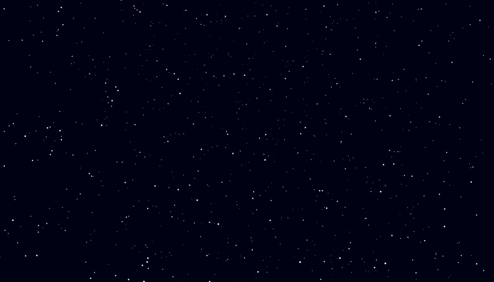

  

# Hey I'm `Alexandre D. Roberge` aka `Aldé` 👋

I’m a Senior Unity Engineer with over 6 years of hands-on experience building and shipping games across VR and mobile platforms.
My passion lies in gameplay programming — crafting responsive, elegant systems through clean architecture and performance-driven design.

I’ve contributed to projects released on **Steam**, the **App Store**, and **Google Play**, always pushing for experiences that feel as good to play as they are to build.

----

- 👨‍💻 Masters in [digital creativity](https://www.uqat.ca/etudes/creation-et-nouveaux-medias/maitrise-en-creation-numerique/) at [UQAT](https://www.uqat.ca/)
- ⚜️ From [Abitibi-Témiscamingue](https://abitibi-temiscamingue.org/), Québec, Canada
- 💬 I speak French and English
- 🧡 I love teaching and learning
- ✨ I beleive **Simple** is _beautiful_
- 🦥 In other words, write **less**, do _more_.

----

<h2>Fin me on...</h2>

* 💜 [Portfolio](https://alderoberge.com)
* 🎮 [Itch.io](https://alde.itch.io/)
* 📷 [Instagram](https://www.instagram.com/alderoberge/)
* 🎶 [Soundcloud](https://soundcloud.com/alexandre-demers-roberge)

----

<h2>🔭 These Days...</h2>

I'm building fun educational courses at [UQAT](https://www.uqat.ca/).

<table>
  <tr>
    <td align="center" width="50%">
      <h2>⚕️ Clinique Ludique</h2>
      
Automated AI video generation for educational purposes

      
    </td>
    <td align="center" width="50%">
      <h2>🎮 Alien Garden</h2>
      
MMORPG to bring people together

      
    </td>
    <td align="center" width="50%">
      <h2>⛏️ Chibogomo VR</h2>
      
A virtual reality game. More details to come :)

      
    </td>
  </tr>
</table>

And some unannounced projects and I can't tell you (yet!) about...

<h2>🔭 Past</h2>

I have been involved in programming and game design for many years, starting around 2010 or so.

Some previous projects include : 
* [Wikwemot-AR](https://minwashin.org/en/wikwemot/)
* [CUBIJAM24's Dream Factory](https://sambro.itch.io/the-dream-factory) (Game Jam Winners!)
* [MA Game Jam 24 - L'étoile de Nourry-Andona](https://alde.itch.io/etoile-de-nourry-andona) (Also Game Jam Winners!)
* [Virtual Ramen's Mother Voice](https://alde.itch.io/mothers-voice)

### 🛠 Tools I use and love 💘

<table>
  <tbody>
    <tr valign="top">
      <td width="100px" align="center">
        Rider   
        
      </td>
      <td width="100px" align="center">
        C#   
        
      </td>
      <td width="100px" align="center">
        Unity   
        
      </td>
      <td width="100px" align="center">
        MongoDB   
        
      </td>
      <td width="100px" align="center">
        GitHub   
        
      </td>
      <td width="100px" align="center">
        Windows   
        
      </td>
      <td width="100px" align="center">
        Docker   
        
      </td>
      <td width="100px" align="center">
        Trello   
        
      </td>
      <td width="100px" align="center">
        Miro   
        
      </td>
    </tr>
  </tbody>
</table>

### 📈 Some stats

Feel free to check out my work, collaborate, or just say hi!
